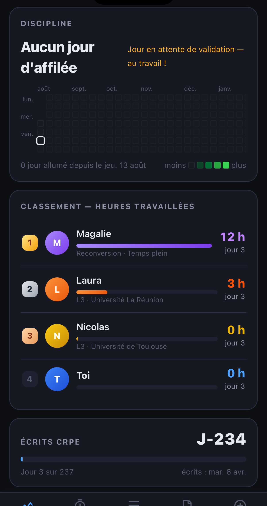

# Peloton — CRPE 2027

[](https://github.com/ycklsr/Peloton/actions/workflows/tests.yml)

A macOS and iOS app for preparing the CRPE, the French competitive exam for
primary school teachers.

A competitive exam is not a test. You don't clear a bar — you take a seat. So the
app counts **hours**, and it counts them against other people. Three simulated
candidates — Laura, Magalie, Nicolas — work every day on a deterministic
schedule of their own. They keep moving whether the app is open or not.

Everything on screen is a number of hours you could check against your own
stopwatch. No score, no index, no probability of being admitted — see
[Hours, and nothing else](#hours-and-nothing-else).



## What it does

- **Ranks you by hours worked**, against three candidates placed at fixed
  multiples of an advised volume: half of it, on it, half again above. Reading
  the standing does not require knowing who anybody is.
- **Projects the total you are heading for.** At your current pace, how many
  hours will you have worked by April, against the advice? The bar goes red,
  amber at three quarters, green when you get there. Miss a day and the figure
  halves the next morning — the divisor grows whether you work or not.
- **Runs a full mock exam every week**, over two days and at the real durations:
  four hours of French and maths, four on three chosen domains, then the orals
  the next morning. Ten hours forty. The whole peloton sits it at the same hour.
- **Asks you, each evening, for tomorrow.** A time and a duration, chosen the day
  before — the one commitment the app holds you to. One declared rest day a week
  is allowed and breaks nothing.
- **Keeps the chain.** A day counts at twenty minutes; the calendar of lit days
  is the only record of consistency that cannot be inflated by sitting longer.
- **Schedules system notifications** — the rivals' sessions, your own
  appointment, the shared paper. The plan for the next ten days is rebuilt on
  every action and every launch.
- **Puts it on the lock screen and the desktop**, through WidgetKit: minutes done
  over minutes aimed at, and the countdown to the writtens.
- **Syncs Mac ↔ iPhone with no server and no account**, through a shared folder.
  iCloud Drive is enough; so is anything else that syncs a directory.
- **Works fully offline.** Each device keeps a complete copy of everything; the
  shared folder is only transport.

## Hours, and nothing else

A study app is tempted to show you a probability of being admitted. This one
does not, and the reason is that such a number cannot be built honestly: no
public data ties a volume of work to being taken. Every constant in such a model
would be chosen rather than fitted, and the result would look like a probability
without being able to act like one.

Hours have no such problem. You can check any figure here against your own
stopwatch, which is the whole point — a number you cannot reproduce is a number
you end up not trusting.

An hour is an hour, too. Weighting work by type — a past paper worth 1.3, a
re-reading worth 0.7 — is a judgment about what learning is worth that nobody
has measured, and it puts every figure on screen at one remove from the clock.
The types are recorded and shown; they describe a session, they do not price it.

The advised total is a setting, and it is documented as a convention rather than
a measurement: preparation providers converge on 600 to 900 hours for a
nine-to-twelve month run, and the default sits just above that band. Raise it or
lower it and the whole scale follows, the peloton included.

The consequence is accepted rather than hidden: programme coverage and
consistency do not weigh on any number. Erosion is shown in the Programme tab
and a repaired chapter is reported after a session, but neither costs nor earns
anything. That is the price of a page that can be read at a glance.

## Architecture: two airtight halves

| | |
|---|---|
| `Peloton/Peloton/duel-crpe-2027.html` | **The entire domain** — the peloton, the interface, and the definition of what counts as a fact. One single file. |
| `Peloton/Peloton/Sync/` and `Bridge/` | **A generic sync engine** that knows nothing about the exam. It carries opaque facts between devices. |

The consequence is deliberate: **adding a feature takes no Swift at all.** See
[ARCHITECTURE.md](ARCHITECTURE.md) for the details.

Sync rests on three properties. Each device writes **only its own file**, so
iCloud never has a conflict to arbitrate. Those files hold **the history of
actions**, not the resulting state, so merging two devices loses nothing. And
state is a **pure function** of that history — same log, same result, whatever
order the files arrive in.

One rule follows from that and is enforced throughout: a fact is never edited,
only added. A session cannot be backdated, a mark cannot be entered the day
after the paper. The app records decisions at the moment they are made, because
a decision remembered on Tuesday is not the same object as one taken on Saturday.

## Install

The project builds in Xcode without a paid developer account.
[INSTALLATION.md](INSTALLATION.md) walks through it step by step, and
`Tools/install-mac.sh` and `Tools/install-ios.sh` do it in one command each.

## Verify

```bash
node Tests/projection.test.mjs Peloton/Peloton/duel-crpe-2027.html
node Tests/notifications.test.mjs Peloton/Peloton/duel-crpe-2027.html
```

Both suites load the **real** HTML file, not a copy, and run on every push and
before either install script builds anything. The first holds the sync
properties: convergence, idempotence, nothing lost, nothing resurrected. The
second holds the notification contract handed to Swift — where a timestamp Swift
cannot parse means a reminder that silently never fires. See
[Tests/README.md](Tests/README.md).

## A note on avatars

Each candidate gets a coloured badge bearing an initial. The author's build puts
photographs there instead; they stay on that machine and are not distributed.

That is enforced rather than promised. A git `clean` filter — declared in
`.git/info/attributes`, run on every write — strips the photo rules out of the
HTML before git records it, along with the mask that hides the initials and the
framing that positions the images. It matches on the CSS rules themselves rather
than on the comment above them, so rewording that comment cannot disarm it, and
it **refuses the write** if an encoded image survives, if the initials would stay
hidden, or if the four gradient fallbacks are missing. The photos are on one
machine and cannot leave it by accident.

## Language

The app, the code comments and the remaining documentation are in French — it is
a French exam. This README is the exception.

## Licence

[MIT](LICENSE).
